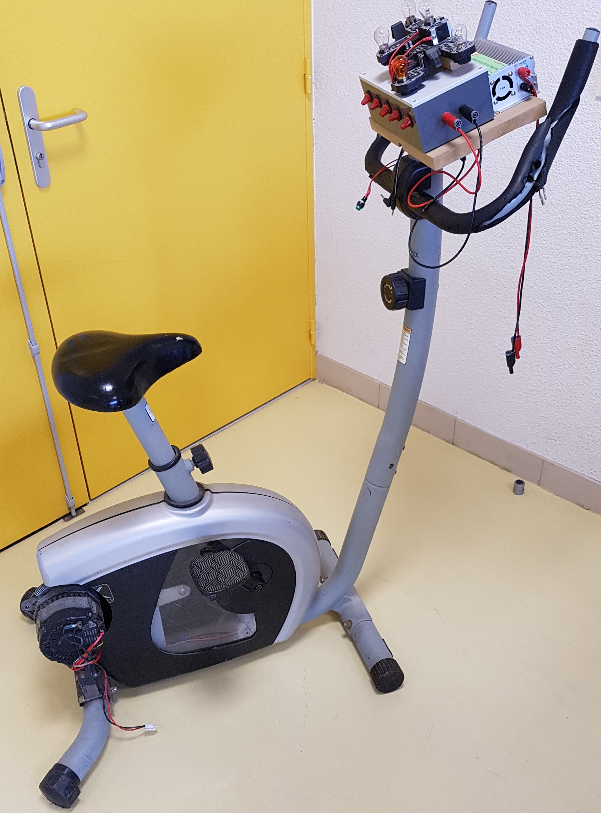

# GENERATEUR A PEDALAGE

### 1- IDEE DE BASE
L’idée initiale était de transformer un vélo d'appartement en génératrice pour créer une station d'éclairage d'une zone dans une école primaire à partir du pédalage des élèves.

### 2 - OBJECTIF DU PROJET :
Concevoir et réaliser un prototype, transformant un vélo d’appartement en génératrice électrique à pédalage permettant d'éclairer une zone et utilisables facilement par des élèves d'une école primaire.

### 3 - LES CONTRAINTES :
- Pour répondre à des perspectives durables et éco responsables, le projet doit réutiliser un maximum de matériels et de composants issus de la récupération et du recyclage.
- La sécurité étant une contrainte importante, il a été choisi de limiter l’éclairage électrique en basse tension mais pour que les solutions technologiques soient crédibles d’un point de vue industriel, d’utiliser une tension continue de 12V comme sur les véhicules grand public (voitures, caravanes, bateaux de plaisance, etc).
- Pour l’information des élèves et du grand public, un affichage de la production électrique instantanée devra être prévue pendant le pédalage.

### 4 - REALISATION
Ce projet à abouti sur un prototype fonctionnel utilisant des lampes de voitures 12V qui étaient encore, en 2014, principalement à incandescences. Les technologies LEDS n'étaient pas encore généralisées.

 

Le système était controlé par plusieurs interrupteurs permettant de choisir le nombre de lampes alimentées.
  

Les tests menés ont permis d'établir des pointes à plus de 250W de puissance électrique en sortie malgré les pertes très importantes des solutions mécaniques retenues pour le prototype.

Il a ensuite évolué pour devenir une source électrique 220V 50Hz grâce à l'utilisation d'un onduleur dont le schéma électrique est donné ci-dessous :

 

  
  

